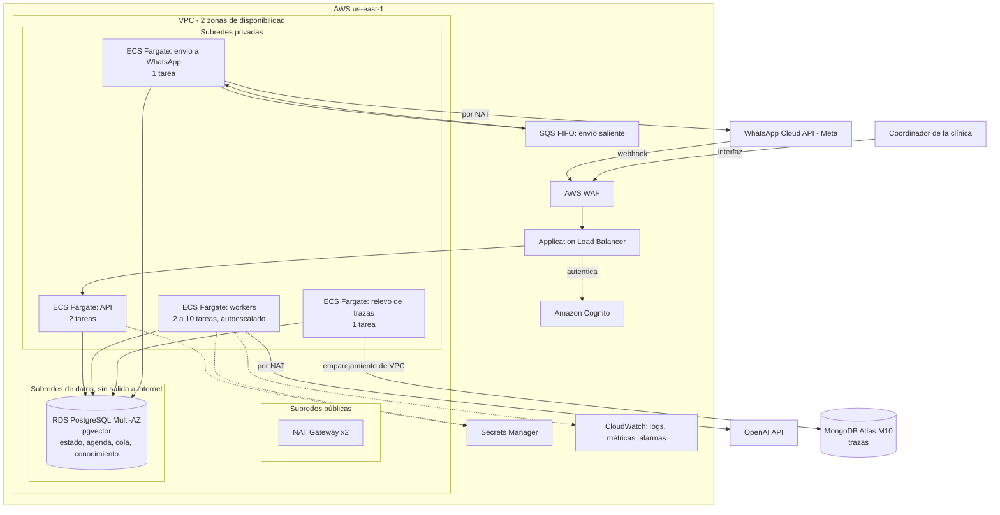

# Diseño en AWS

Cómo se desplegaría este sistema para 50 clínicas y 20.000 mensajes al día. Es un diseño: nada de esto está desplegado ni probado. Los precios se consultaron el 4 de octubre de 2026 en las páginas oficiales de cada proveedor, para la región `us-east-1`; los que no se pudieron confirmar en una página oficial están marcados.

## 1. De qué tamaño es el problema

| Dato | Valor | De dónde sale |
|---|---|---|
| Mensajes al mes | 600.000 | 20.000 al día |
| Pico | 2 a 4,5 mensajes por segundo | 80 % del tráfico en 10 horas, con un factor de pico de 4 a 10 |
| Duración de un turno | Unos 8 s | 2 o 3 llamadas al modelo de 2 a 3 s cada una. Supuesto de dimensionamiento. Primera ejecución real observada: 2,4 a 5,2 s por turno en una conversación; la muestra es insuficiente para reemplazar el supuesto |
| Turnos simultáneos en el pico | 18 a 36 | Pico por duración del turno |
| Tamaño de la base | Menos de 50 GB | Mensajes, agenda y conocimiento de 50 clínicas |

Es un sistema pequeño. Casi todo el tiempo de un turno es espera de red (modelo y base de datos), no cómputo. La infraestructura es sobre todo costo fijo; el modelo de lenguaje es el principal costo variable y, según el modelo elegido y cuánto se aproveche la caché, puede ser o no el mayor componente de la cuenta. La mayoría de las decisiones de abajo eligen la opción más simple que cumple.

## 2. Diagrama

## 3. Decisiones

### 3.1 Región: `us-east-1`

La alternativa natural para usuarios en Colombia es São Paulo (`sa-east-1`). Se elige `us-east-1` por dos razones. La primera es el precio: la misma base de datos cuesta 0,442 USD por hora en São Paulo frente a 0,337 aquí, y el almacenamiento casi el doble. La segunda es la cercanía esperada al proveedor del modelo, que es lo que más tarda en cada turno: OpenAI no ofrece procesamiento regional en Sudamérica (sus regiones de residencia de datos son Estados Unidos, Europa y Asia-Pacífico).

La latencia no se ha medido. Antes de producción hay que medirla de extremo a extremo desde Colombia hacia las dos regiones. `sa-east-1` queda como alternativa si esa medición o un requisito de residencia de datos lo justifican.

Queda una pregunta que no es técnica: los mensajes son datos personales y pueden incluir datos de salud. Antes de producción hay que validar con un abogado las condiciones de la ley colombiana para transferir esos datos a otro país y a un proveedor de IA. No soy abogado y este documento no resuelve eso.

### 3.2 Base de datos: RDS PostgreSQL en instancia Multi-AZ

PostgreSQL es aquí fuente de verdad, cola y almacén de vectores, así que esta es la decisión que condiciona las demás. Se compararon tres despliegues:

| | RDS, instancia Multi-AZ | RDS, clúster Multi-AZ | Aurora PostgreSQL |
|---|---|---|---|
| Conmutación ante fallo (texto de AWS) | "típicamente 60 a 120 segundos" | "típicamente menos de 35 segundos" | "menos de 60 segundos, a menudo menos de 30" con réplica |
| Réplicas de lectura incluidas | No (la de respaldo no se puede leer) | Dos | Las que se agreguen |
| pgvector y btree_gist | Sí | Sí | Sí |
| Clases de instancia pequeñas | Cualquiera | Solo clases con disco local (c6gd, m6gd, r6gd…) | t4g, r6g, r7g, o Serverless v2 |
| Precio por hora, 2 vCPU | 0,337 (m7g.large, las dos instancias) | 0,522 (m6gd.large, las tres) | 0,52 (dos r6g.large) |
| Almacenamiento por GB al mes | 0,23 (gp3) | io1 a 0,375 más IOPS; gp3 sin confirmar | 0,10 más 0,20 por millón de operaciones |
| Al mes, con 50 GB | Unos 258 USD | Unos 400 USD o más | Unos 385 USD más operaciones |

**Elección: instancia Multi-AZ, `db.m7g.large` (2 vCPU, 8 GB), 50 GB en gp3.**

El motivo es que este sistema ya tolera una interrupción de dos minutos sin perder ningún trabajo confirmado en PostgreSQL, y esa interrupción es justo lo que diferencia a las opciones más caras. Los webhooks que llegan durante la caída no se guardan en ningún lado: dependen de que el proveedor reintente.

- Durante la conmutación el webhook responde 503. Meta reintenta la entrega "con frecuencia decreciente… hasta por 7 días", y el `message_id` hace que el reintento sea inofensivo.
- Los intentos en curso fallan como error de infraestructura y se reintentan; sus candados vencen solos.
- El efecto para el paciente es una respuesta que llega uno o dos minutos tarde.

Pagar unos 140 USD más al mes por bajar de 120 a 35 segundos no compra nada que el diseño necesite. Las réplicas de lectura tampoco: todas las lecturas de este sistema son pequeñas y van al primario.

Aurora se descarta por lo mismo: hoy no resuelve ningún problema que este sistema tenga. Ofrece mejor escalado de lecturas y conmutación más rápida, y ninguna de las dos cosas hace falta a esta carga. Como razón secundaria, RDS es el mismo motor sobre el que se midió todo lo verificado en este proyecto (planes de consulta, tiempos de la cola, búsqueda vectorial); con Aurora habría que repetir esas mediciones.

Se evita la clase `t4g` aunque es más barata (94 a 188 USD al mes): su rendimiento sostenido depende de créditos de CPU, y esta base aloja además la cola y la búsqueda vectorial. No hay una medición de carga prolongada que demuestre que los créditos alcanzan; sin ella se prefiere una clase de rendimiento constante.

**Conexiones.** El máximo por defecto se deriva de la memoria (algo menos de 900 con 8 GB; valor exacto sin confirmar). El techo del diseño, con 10 tareas de worker de 4 mensajes a la vez (14 conexiones por tarea), más la API y los relevos, es de unas 165. No hace falta RDS Proxy con este presupuesto de conexiones. Si en el futuro se incorporara, habría que verificar antes cómo trata lo que usan los protocolos de esta aplicación dentro de cada transacción (el bloqueo consultivo del reclamo y los límites de tiempo con `SET LOCAL`): no se ha probado.

**Cuándo se revisa esta decisión.** Si aparece un requisito de disponibilidad que no admita dos minutos, se pasa a clúster Multi-AZ. Si las lecturas de la bandeja crecen hasta competir con la cola, lo mismo, por sus réplicas legibles.

### 3.3 Cola: PostgreSQL

Decidido en [`ADR-001-cola-en-produccion.md`](ADR-001-cola-en-produccion.md). SQS FIFO no reemplazaría el candado por conversación, la protección por número de intento ni el tope por clínica; los seguiría necesitando todos y añadiría un componente.

### 3.4 Cómputo: ECS con Fargate

Cuatro servicios, la misma imagen de contenedor, procesadores ARM:

| Servicio | Tareas | Tamaño | Escala por |
|---|---|---|---|
| API | 2 fijas, una por zona | 0,25 vCPU, 0,5 GB | No escala: 4,5 peticiones por segundo es poco para una tarea |
| Workers | 2 a 10 | 0,5 vCPU, 1 GB, 4 mensajes a la vez cada una (`WORKER_CONCURRENCIA`, el valor por defecto del código) | Mensajes que se pueden reclamar, por tarea |
| Relevo de trazas (PostgreSQL a Mongo) | 1 (ECS la repone si muere) | 0,25 vCPU, 0,5 GB | No escala |
| Envío a WhatsApp (PostgreSQL a SQS, y SQS a Meta) | 1 (ECS la repone si muere) | 0,25 vCPU, 0,5 GB | Mensajes en la cola SQS, si hiciera falta |

El relevo de trazas y el envío a WhatsApp son servicios separados aunque usen la misma imagen, porque fallan por causas distintas y no deben arrastrarse: si Atlas se cae, las respuestas se siguen enviando; si Meta se degrada, las trazas siguen llegando a Mongo. También separa los permisos: el relevo de trazas accede a PostgreSQL y a Atlas, y no tiene las credenciales de Meta; el servicio de envío accede a PostgreSQL, SQS y Meta, y no a Atlas.

Dentro del envío, publicar en SQS y consumir de SQS van en el mismo servicio, como dos ciclos independientes, cada uno con su manejo de errores y su espera. Si Meta se degrada, el consumidor reintenta con espera y el publicador sigue encolando respuestas. Si PostgreSQL no responde, se detienen los dos: el publicador no tiene de dónde leer y el consumidor no puede comprobar si un envío ya se hizo. Los mensajes esperan en SQS, y eso es lo correcto: enviar sin esa comprobación sería renunciar a la protección contra duplicados. Separarlos en dos servicios permitiría reducir más los permisos (el publicador no necesita la credencial de Meta ni recibir de la cola; el consumidor no necesita publicar en ella) y escalarlos por separado. A este volumen no compensa otra unidad que operar. Se separarían si la carga, el aislamiento de fallos o el mínimo privilegio lo justificaran; el consumidor también usa PostgreSQL, para comprobar y registrar que un envío ya se hizo.

Alternativas descartadas:

- **Lambda.** El worker es un ciclo que consulta una cola en PostgreSQL y mantiene turnos de hasta 60 s con conexiones abiertas. Lambda encaja con eventos cortos; aquí obligaría a poner un disparador delante de la cola y a gestionar conexiones con un proxy.
- **EKS.** Kubernetes para cuatro servicios es costo fijo y operación que no aportan nada a este tamaño.
- **EC2.** Más barato por hora, pero hay que parchear y dimensionar máquinas. Con unos 72 USD al mes de cómputo, no compensa.

Se prefieren más tareas pequeñas a menos tareas con más mensajes cada una. Cuatro mensajes por tarea deja que el escalado, los despliegues y los fallos ocurran en pasos pequeños: una tarea que muere interrumpe 4 turnos, no 10. El valor no sale de una medición; subirlo solo se justifica midiendo CPU y memoria por turno con el modelo real. Con 2 tareas se cubre la carga media de las horas activas (unos 4 turnos a la vez) y con 10 el extremo alto del pico (40).

En el código actual existen la API, el worker y el relevo de trazas; este último corre dentro del proceso del worker, y separarlo en su propio servicio es cambiar el punto de entrada, no la lógica. El servicio de envío a WhatsApp no está implementado.

### 3.5 Entrada: Application Load Balancer con WAF

El balanceador recibe el webhook de Meta y sirve la interfaz del coordinador. WAF aplica delante un límite de peticiones por IP y las reglas administradas básicas.

Se consideró API Gateway (1 USD por millón de peticiones, frente a unos 22 USD al mes del balanceador). Es más barato, pero para llegar a tareas en subredes privadas necesita un enlace de VPC, y la interfaz necesitaría otro camino. Un solo balanceador para las dos cosas es más simple.

Dos controles que hoy no existen en el código y son obligatorios en producción:

- **Firma del webhook.** Meta firma cada petición (`X-Hub-Signature-256`). La API debe verificarla con el secreto de la aplicación antes de aceptar el mensaje. Sin eso, cualquiera puede enviar mensajes a nombre de cualquier teléfono.
- **Autenticación del coordinador.** Cognito, integrado en el balanceador. Cada usuario tiene asociadas sus clínicas, y la API toma la clínica de ese dato, nunca de un parámetro.

### 3.6 Red

Una VPC en dos zonas de disponibilidad con tres niveles de subred: públicas (balanceador y NAT), privadas (tareas) y de datos (RDS, sin ruta a internet). Los grupos de seguridad permiten solo el camino necesario: balanceador a API, tareas a RDS.

Las tareas necesitan salir a internet para llamar a OpenAI y a Meta. Eso exige NAT. Se ponen dos, uno por zona (unos 66 USD al mes), para que la caída de una zona no deje sin salida a las tareas de la otra. Con uno solo se ahorran 33 USD y se acepta que, si cae su zona, el asistente deja de poder llamar al modelo hasta que se recree.

No se usan puntos de enlace privados para ECR, CloudWatch y Secrets Manager: cada uno cuesta unos 7 USD al mes por zona, más que el tráfico que evitarían por NAT a este volumen. El de S3, que es gratuito, sí.

### 3.7 MongoDB: Atlas M10

| | Atlas M10 | Atlas Flex | DocumentDB |
|---|---|---|---|
| Qué es | MongoDB real, dedicado | MongoDB real, compartido | Servicio de AWS compatible con la API de MongoDB |
| Precio | 0,08 USD por hora (unos 58 al mes) | 8 a 30 USD al mes | Instancias pequeñas a unos 0,076 USD por hora cada una (fuente secundaria, sin confirmar); se necesitan dos para alta disponibilidad |
| Red privada | Emparejamiento de VPC o PrivateLink | No | Dentro de la VPC |
| Límite relevante | Otro proveedor y otra factura | Sin red privada | "Ignora w=cualquier valor"; compatibilidad con las API 3.6 a 8.0, no es el mismo motor |

**Elección: Atlas M10 en `us-east-1`, conectado por emparejamiento de VPC.** Es el mismo MongoDB que se usa en desarrollo, con red privada, y cuesta menos que dos instancias de DocumentDB.

DocumentDB funcionaría: el sistema solo inserta, crea un índice único y lee por clave. Su ventaja es que todo queda en una cuenta y una VPC. Si la organización prefiere un solo proveedor, es un cambio de cadena de conexión.

Lo que hace barata esta decisión es el diseño: Mongo está fuera del camino crítico. Si Atlas se cae, los turnos cierran igual y las trazas esperan en PostgreSQL.

**Retención.** Unas 25.000 trazas al día de 2 a 5 KB son 25 a 30 GB al año. Las trazas contienen el texto del paciente. Se propone un índice de vencimiento (TTL) de 90 días en Mongo; el plazo real es una decisión legal y de negocio, no técnica.

### 3.8 Envío de la respuesta a WhatsApp

Hoy la respuesta se guarda y se muestra en la interfaz; no se envía. En producción:

1. El cierre del turno deja la respuesta en una tabla de envíos pendientes, en la misma transacción. Es el mismo patrón que ya se usa para las trazas.
2. Un relevo la publica en una cola SQS FIFO, con la conversación como grupo (conserva el orden por paciente) y el `message_id` como identificador de deduplicación.
3. Un consumidor llama a la API de Meta. Si falla, SQS reintenta; tras varios fallos, el mensaje pasa a una cola de mensajes fallidos y salta una alarma.

La deduplicación de SQS no basta como garantía. SQS FIFO solo recuerda el identificador de deduplicación durante 5 minutos: si el relevo publica, muere antes de marcar el envío como publicado y se recupera pasado ese tiempo, el mensaje entra dos veces. Por eso el consumidor necesita su propia idempotencia: antes de llamar a Meta comprueba en PostgreSQL si ese envío ya está registrado como hecho, y lo registra al terminar.

Queda una ventana que no se puede cerrar desde este lado: Meta acepta el mensaje y el consumidor muere antes de registrarlo. En ese caso el paciente puede recibir la respuesta dos veces. Evitarlo exige que el proveedor acepte una clave de idempotencia, y no se ha verificado que la API de Meta la ofrezca. La entrega es de al menos una vez, y se prefiere eso a perder una respuesta.

Aquí SQS sí encaja, y no contradice la decisión de la cola: transporta un mensaje que ya es cierto en PostgreSQL. No guarda estado ni decide nada. Lo que aporta es el reintento con espera y la cola de fallidos sin escribirlos.

### 3.9 Secretos y permisos

Secrets Manager guarda la clave de OpenAI, la credencial de la base (gestionada y rotada por RDS), la cadena de conexión de Atlas y el token y el secreto de Meta. ECS los entrega a cada tarea al arrancar; no están en la imagen ni en variables escritas en el repositorio.

Cada servicio tiene su propio rol de IAM con lo mínimo: el worker lee la clave de OpenAI y la credencial de la base; la API no puede leer la clave de OpenAI.

En la base, un rol por proceso: API, worker, ingestión y migraciones. El de ingestión es el único que puede escribir conocimiento. Está previsto en la arquitectura y no está implementado: hoy todo usa un solo usuario.

Cifrado en reposo en RDS, Atlas, SQS y logs; TLS en todas las conexiones.

### 3.10 Observabilidad

Logs en formato JSON hacia CloudWatch, sin texto de pacientes: el texto ya queda en las trazas, con acceso controlado.

Métricas propias, publicadas una vez por minuto:

| Métrica | Para qué |
|---|---|
| Mensajes que se pueden reclamar, y edad del más antiguo | Escalar workers; alarma si la edad pasa de 2 minutos |
| Mensajes que esperan cupo de su clínica | Ver una clínica saturada sin escalar por ella |
| Trazas y envíos pendientes, y edad del más antiguo | Caída de Mongo o de Meta; evitar que el outbox llene el disco |
| Intentos fallidos y turnos escalados, por motivo | Calidad del asistente |
| Tokens de entrada y salida, y latencia del modelo | Costo y salud del proveedor |
| Estado del interruptor del proveedor | Error de configuración o caída de OpenAI |
| Trazas en `requiere_revision` | Trazas que Mongo rechaza |

Alarmas sobre esas métricas, y las de RDS que corresponden a una instancia Multi-AZ: CPU, conexiones, memoria disponible, espacio libre, latencia y operaciones por segundo del almacenamiento, y los eventos de conmutación. El retraso de réplica no aplica: la instancia de respaldo se mantiene de forma síncrona y no se puede leer. Solo se vigilaría si más adelante se agregan réplicas de lectura.

La traza por turno (modelo, tokens, latencia, herramientas) ya existe y es la herramienta para investigar una conversación concreta. No se agrega un sistema de trazas distribuidas.

## 4. Escalabilidad

**Workers.** El autoescalado sigue una métrica propia: mensajes que se pueden reclamar divididos por tareas en marcha. Cuenta solo lo que un worker nuevo podría tomar; los mensajes que esperan cupo de su clínica no cuentan, porque más workers no los moverían.

Escalar por la cola sin límites empeora una caída: más workers son más conexiones y más llamadas al modelo, más errores por cuota, más reintentos y más cola. Por eso hay techos que no dependen de la cola:

| Techo | Valor | Protege |
|---|---|---|
| Tareas de worker | 10 (40 turnos a la vez) | La base y el presupuesto. El pico esperado necesita de 5 a 9 |
| Conexiones a PostgreSQL | Unas 165 de menos de 900 | La base |
| Llamadas simultáneas al modelo | 40, por el techo de tareas | La cuota del proveedor |
| Conversaciones en proceso por clínica | 5 por defecto | A las demás clínicas |
| Mensajes por minuto por teléfono | 20 | El costo, frente a un emisor abusivo |

**Cuota de OpenAI.** En el pico, el sistema consume unos 1,5 millones de tokens por minuto y unas 620 peticiones por minuto (estimación a partir del tamaño medido del prompt). Esa es la demanda; el límite no es una constante de este diseño. Antes de producción hay que comprobar que los límites reales de la cuenta para el modelo elegido la superan con margen. Si no la superan, se baja el techo de tareas de worker o se pide más capacidad. Como referencia, el 4 de octubre de 2026 la documentación de OpenAI indicaba 2 millones de tokens por minuto en el nivel de uso 2 y 4 millones en el nivel 3 para los dos candidatos: el nivel 2 dejaría solo un 25 % de margen.

**Base de datos.** El reclamo de la cola cuesta menos de medio milisegundo con 20.000 mensajes atrasados. Uno de los primeros candidatos a cuello de botella es la CPU de la búsqueda vectorial exacta, cuando una clínica pase de unos miles de fragmentos. La primera respuesta es subir de clase de instancia. Si aun así la búsqueda exacta deja de cumplir, habrá que evaluar un índice aproximado (HNSW) y decidir cómo se organiza físicamente por clínica, con datos reales de cuántos fragmentos tiene cada una. Esa decisión sigue abierta: un índice por clínica sirve con 50 clínicas y es un problema de operación con miles.

**Qué pasa con 10 veces la carga (200.000 mensajes al día).** El pico sube a 20 a 45 mensajes por segundo y unos 200 a 360 turnos simultáneos. La cola en PostgreSQL lo soporta según lo medido, pero se necesitarían unas 90 tareas de worker con la concurrencia actual (o subirla, tras medir), una instancia mayor y una cuota de OpenAI diez veces más alta. Ese es el punto donde habría que volver a medir, no antes.

## 5. Qué pasa cuando algo falla

| Falla | Efecto | Recuperación |
|---|---|---|
| Muere una tarea de worker | Su mensaje queda a medias | El candado vence a los 120 s y otro worker lo retoma. Si ya había creado la cita, la confirma sin llamar al modelo |
| Muere una tarea de la API | La otra sigue atendiendo | ECS la repone |
| Cae una zona de disponibilidad | RDS conmuta en 60 a 120 s; quedan la mitad de las tareas | Meta reintenta los webhooks; ECS repone tareas en la otra zona |
| OpenAI con errores o lento | Los intentos fallan y se reintentan; al tercer fallo el paciente recibe la respuesta de respaldo y la conversación pasa a un asesor | Automática |
| OpenAI rechaza la clave o el modelo (error de configuración) | Hoy: igual que la fila anterior, con una alerta | Pendiente: un interruptor que deja de reclamar mensajes, avisa y los deja en cola, en lugar de escalar cada conversación |
| Atlas caído | Ninguno para el paciente. Las trazas esperan en PostgreSQL y la interfaz las lee de ahí | El relevo las publica al volver |
| Meta no acepta envíos | Las respuestas esperan en SQS | Reintentos; cola de fallidos y alarma |
| Despliegue defectuoso | Las tareas nuevas no pasan la comprobación de salud | ECS conserva las anteriores |
| Borrado o corrupción de datos | — | Copias automáticas de RDS con recuperación a un punto en el tiempo |

El interruptor del proveedor no está implementado. Es la mejora de confiabilidad más importante que falta: hoy un error de configuración global se paga conversación por conversación.

## 6. Multi-tenant

El esquema ya separa las clínicas: `clinica_id` recorre toda la cadena con claves foráneas compuestas, y cada consulta filtra por la clínica del contexto. Falta lo que rodea al esquema:

| Tema | Hoy | En producción |
|---|---|---|
| De qué clínica es un mensaje | Una variable de entorno, `CLINICA_ID` | Una tabla que asocia el número de WhatsApp que recibe (`phone_number_id` del webhook) con la clínica |
| Qué clínica ve un coordinador | No hay autenticación | Cognito; la clínica sale de la sesión del usuario |
| Aislamiento de lecturas | Cada consulta filtra por `clinica_id` | Además, seguridad a nivel de fila en PostgreSQL: la transacción declara su clínica y la base rechaza lo demás, aunque una consulta olvide el filtro. El reclamo de la cola usa un rol aparte, porque recorre todas las clínicas |
| Vecino ruidoso | Tope de conversaciones en proceso por clínica, y límite por teléfono | Además, una cuota diaria de mensajes por clínica. Es otra clase de límite: el primero es concurrencia, este es volumen acumulado |
| Configuración por clínica | Zona horaria | Tope de concurrencia y cuota según el plan |
| Conocimiento | Filtrado por clínica y por modelo de embeddings | Igual |

Se elige una base compartida con `clinica_id` y no una base por clínica. Con 50 clínicas pequeñas, 50 bases serían 50 veces el costo fijo y 50 migraciones por cada cambio. La base por clínica tendría sentido para un cliente que lo exija por contrato.

## 7. Modelo de lenguaje y costo por conversación

### Qué cuesta un turno

Tamaños medidos sobre el código, convertidos a tokens con una aproximación de 3,3 caracteres por token:

| Parte | Tokens |
|---|---|
| Reglas y definición de las herramientas (igual en todas las llamadas) | Unos 1.650 |
| Historial, mensaje y resultados de herramientas | Unos 750 |
| Entrada por llamada | Unos 2.400 |
| Salida por llamada (una llamada a herramienta) | Unos 45 |
| Llamadas por mensaje | 2,3 en promedio |

Una conversación típica tiene 4 mensajes del paciente (una pregunta y un agendamiento en tres pasos): 9 llamadas, unos 22.000 tokens de entrada y 400 de salida.

### Modelos candidatos

| Modelo | Entrada | Entrada en caché | Salida | Por conversación | Al mes |
|---|---|---|---|---|---|
| `gpt-4o-mini` | 0,15 | 0,075 | 0,60 | 0,0026 a 0,0035 USD | 385 a 530 USD |
| `gpt-6-luna` | 0,10 | 0,01 | 0,50 | 0,0013 a 0,0028 USD | 190 a 420 USD |

Precios en USD por millón de tokens, del nivel de procesamiento estándar y contexto corto, leídos el 4 de octubre de 2026 en la página de precios de OpenAI y en la de cada modelo. No son los precios de los niveles Batch y Flex, que cuestan la mitad (0,05 / 0,005 / 0,25 para `gpt-6-luna`): Batch es asíncrono y Flex es más lento y puede no estar disponible, así que no sirven para responderle a un paciente.

El extremo bajo del rango supone un 60 % de la entrada leída de caché; el alto, que la caché no ahorra nada. Para `gpt-6-luna` existe además un costo de escritura en caché de 0,125 por millón de tokens, mayor que el de la entrada normal. Con ese modelo todavía no se han medido en conversaciones reales los tokens leídos de caché ni los escritos, así que su rango es orientativo y deliberadamente conservador: su extremo alto supone que todo el prefijo se cobra como escritura. La traza de cada intento registra los tokens leídos de caché, para poder medirlo.

El prompt está ordenado para aprovechar la caché: lo que no cambia va primero y la fecha del mensaje al final. El ahorro real depende de cómo el proveedor aplique la caché. Con `gpt-4o-mini`, en las conversaciones de prueba del 4 de octubre de 2026, se leyó de caché alrededor del 60 % de la entrada; son conversaciones cortas y pocas, así que orienta el supuesto pero no lo reemplaza.

**Estado de la decisión.** El valor por defecto del proyecto es `gpt-4o-mini`: acepta los parámetros que usa el adaptador y no tiene aviso de retiro. Es un modelo de 2024. `gpt-6-luna` es más barato y actual, pero OpenAI documenta que solo acepta herramientas en esta API con el razonamiento desactivado; el adaptador ya permite configurarlo.

Con este sistema solo se ha ejecutado `gpt-4o-mini`, en conversaciones de prueba hechas a mano; `gpt-6-luna`, no. Elegir por precio sería elegir a ciegas: lo que importa es que el modelo escoja bien la herramienta y las líneas en español. La decisión correcta es armar un conjunto de 30 a 50 conversaciones de prueba, correrlo con los dos y elegir el más barato que no falle.

**Datos.** OpenAI declara que los datos enviados por la API no se usan para entrenar sus modelos salvo que el cliente lo autorice, y que conserva registros de control de abuso 30 días por defecto. Existe retención cero para clientes aprobados.

## 8. Costo mensual

| Componente | Cálculo | USD al mes |
|---|---|---|
| RDS PostgreSQL Multi-AZ, `db.m7g.large` | 0,337 por hora | 246 |
| Almacenamiento y copias de RDS | 50 GB a 0,23, más copias | 14 |
| Fargate | API 14, workers 43 (3 tareas en promedio), relevo de trazas 7, envío 7 | 72 |
| Balanceador | 0,0225 por hora más unidades de capacidad | 22 |
| NAT, dos | 0,045 por hora cada uno, más tráfico | 67 |
| WAF | Lista, tres reglas y peticiones | 8 |
| CloudWatch | Logs, 20 métricas, 10 alarmas | 10 |
| Secrets Manager, ECR, S3, SQS, KMS | | 5 |
| **AWS** | | **Unos 444** |
| MongoDB Atlas M10 | 0,08 por hora | 58 |
| Modelo de lenguaje | Según modelo y caché | 190 a 530 |
| **Total** | | **Unos 690 a 1.030** |

Eso es de 14 a 21 USD por clínica al mes, o entre 0,0012 y 0,0017 USD por mensaje.

Qué mueve la cuenta:

- El modelo de lenguaje es entre el 27 % y el 51 % del total. En el escenario más barato AWS cuesta más del doble que el modelo; en el más caro, el modelo es el mayor componente. Es el costo que crece con el uso, y elegir modelo y aprovechar la caché es la decisión que más lo mueve.
- La base de datos es más de la mitad de AWS. Con un compromiso de un año baja alrededor de un tercio (porcentaje sin confirmar).
- La infraestructura es casi toda costo fijo: con la mitad de mensajes, la cuenta de AWS casi no baja.

Cifras sin confirmar en página oficial: el precio de NAT se leyó de un ejemplo de otra región de Estados Unidos; el de SQS, de un anuncio antiguo de AWS; que el precio de Atlas M10 incluya los tres nodos; y el precio del emparejamiento de VPC con Atlas. Ninguna cambia el orden de magnitud.

## 9. Lo que este diseño no resuelve

- Nada está desplegado. No hay infraestructura como código.
- No hay integración continua. En producción, cada cambio debe pasar por instalación limpia, comprobación de tipos, tests, `npm audit` y análisis de la imagen antes de construirla. Esta entrega mostró por qué: una dependencia tenía cuatro avisos de severidad alta y solo apareció al ejecutar la auditoría.
- Los supuestos de carga (duración del turno, forma del pico, tokens por turno) son estimaciones. La primera semana en producción debe medirlos.
- La transferencia internacional de datos de pacientes necesita validación legal.
- El interruptor del proveedor, la firma del webhook, la autenticación del coordinador, la seguridad a nivel de fila, los roles de base por proceso, la cuota por clínica y el envío a WhatsApp están diseñados aquí y no implementados.
- El plan de recuperación ante la pérdida de toda la región no existe: las copias quedan en la misma región.
